# Proceso de carga de datos y pruebas realizadas

## SELECT de las tablas

### Tabla GENERO

### Tabla SERIE

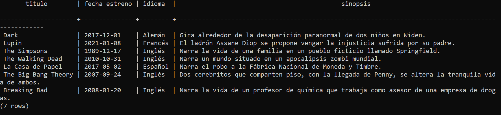

### Tabla SERIE_PERTENECE_GENERO

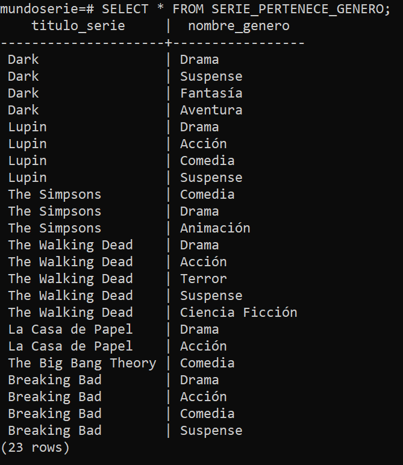

### Tabla TEMPORADA

### Tabla CAPITULO

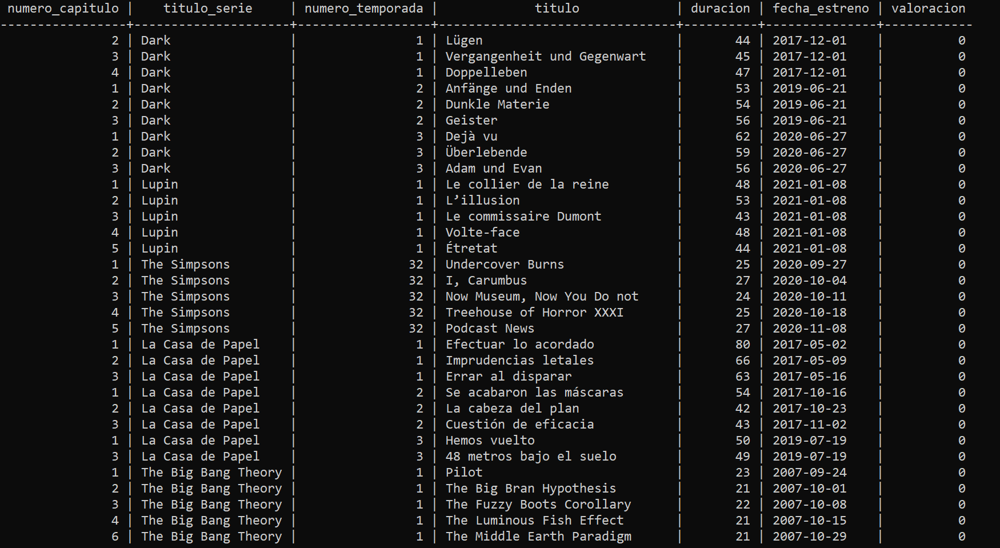

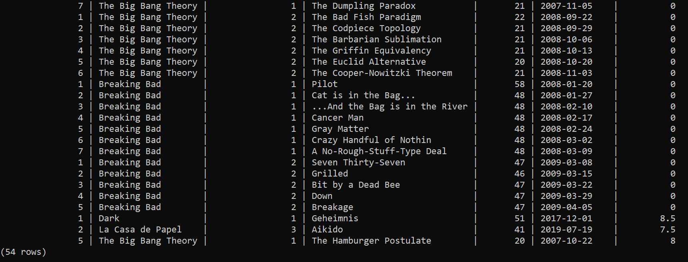

### Tabla USUARIO

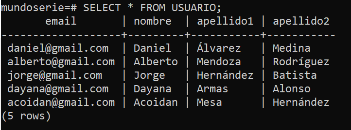

### Tabla ADMINISTRADOR

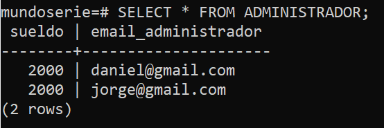

### Tabla CLIENTE

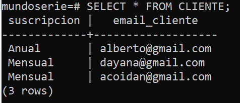

### Tabla PERSONA

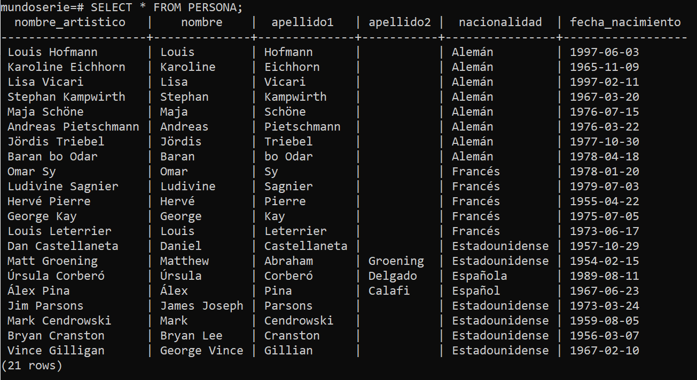

### Tabla PERSONA_PARTICIPA_CAPITULO

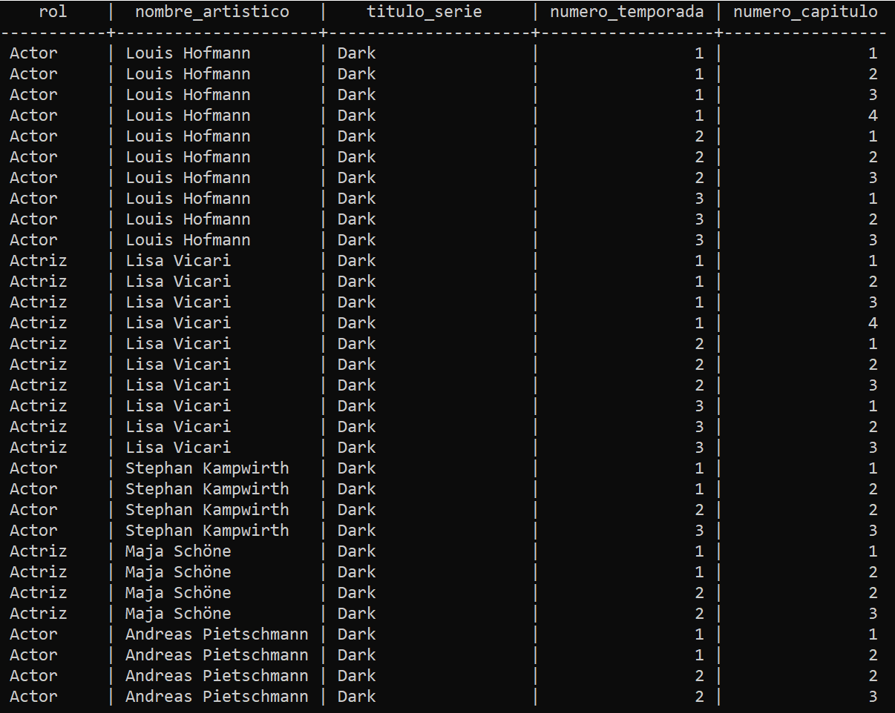

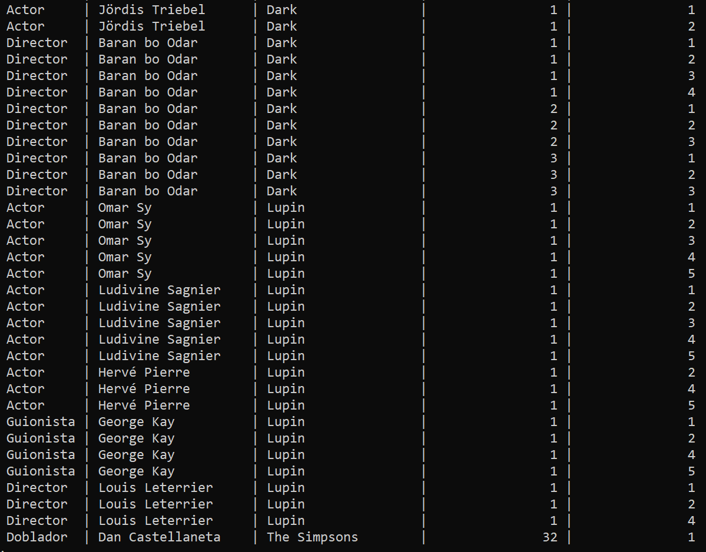

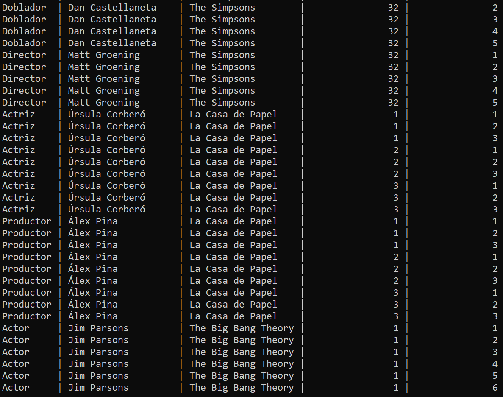

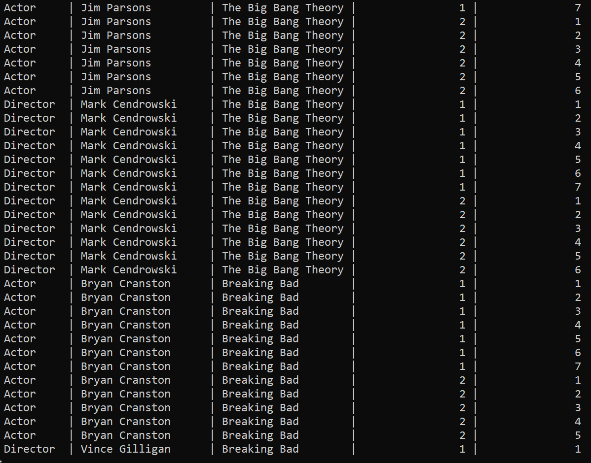

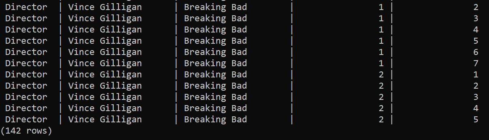

### Tabla CLIENTE_VALORA_CAPITULO

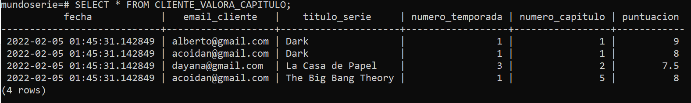

### Tabla CLIENTE_COMENTA_SERIE

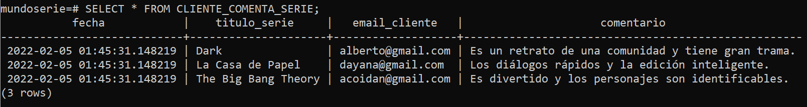

## Funcionamiento triggers

### Trigger trigger_comprobar_numero_generos_before_insert

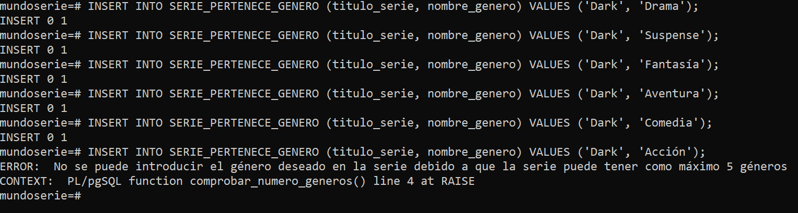

Se han realizado 5 inserciones sobre la tabla SERIE_PERTENECE_GENERO correctamente y a la sexta ha notificado de un error debido a que una serie no puede tener más de 5 géneros.

### Trigger trigger_verificar_email_before_insert

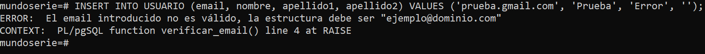

Se ha realizado 1 inserción sobre la tabla USUARIO y al no tener la estructura correcta del correo electrónico, notifica de un error.

### Trigger trigger_comprobar_valoracion_capitulo_before_insert

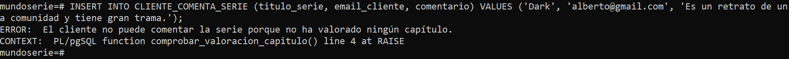

Se ha llevado a cabo 1 inserción en la tabla CLIENTE_COMENTA_SERIE y no se ha podido realizar debido a que este cliente no había comentado ningún capítulo de esta serie.

### Trigger trigger_calcular_valoracion_after_insert

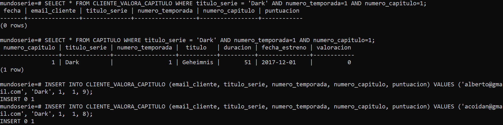

Inicialmente, en la tabla CLIENTE_VALORA_CAPITULO se muestra a través de los SELECT como por defecto en la serie Dark, temporada 1 y capítulo 1 no existe ninguna valoración y por lo tanto, por defecto la valoración del capítulo, que corresponde a la media de las valoraciones, es 0 en la tabla CAPITULO.

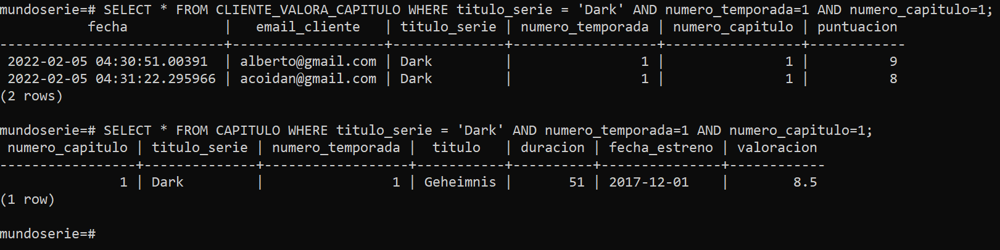

Luego, se realizan 2 inserciones de 2 clientes que permiten valorar el capítulo y por lo tanto, calcular la media de la valoración del capítulo.

## Funcionamiento check

### Check administrador_sueldo_check

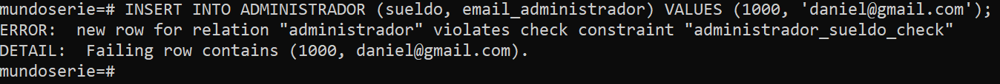

Se lleva a cabo una inserción en la tabla ADMINISTRADOR cuyo sueldo es 1000 y dado que es menor que el sueldo mínimo pues no se realiza.

### Check cliente_suscripcion_check

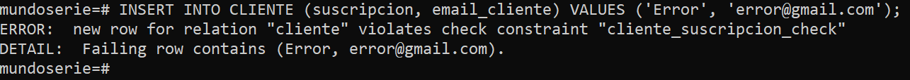

Se lleva a cabo una inserción en la tabla CLIENTE se comprueba que solo se aceptan dos tipos de suscripciones 'Mensual' o 'Anual', si se introduce una suscripción distinta, notifica de un error.

### Check cliente_valora_capitulo_puntuacion_check

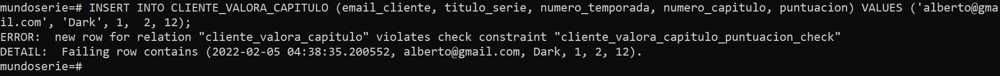

Se lleva a cabo una inserción en la tabla CLIENTE_VALORA_CAPITULO permite que solo se acepten valoraciones entre 1 y 10, por lo tanto si se introduce un número valor a ello o menor, notifica de un error.

