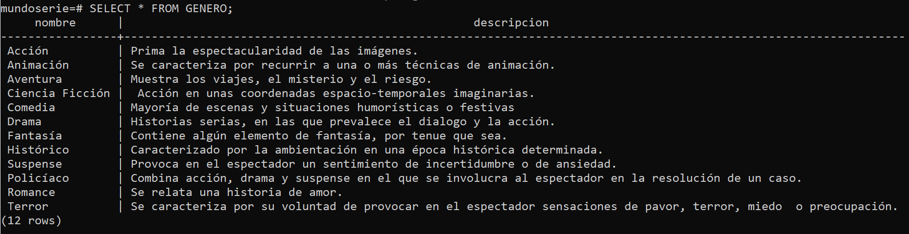
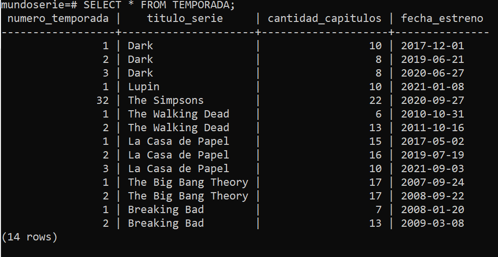

# Proceso de carga de datos y pruebas realizadas

## SELECT de las tablas

### Tabla GENERO

### Tabla SERIE

### Tabla SERIE_PERTENECE_GENERO

### Tabla TEMPORADA

### Tabla CAPITULO

### Tabla USUARIO

### Tabla ADMINISTRADOR

### Tabla CLIENTE

### Tabla PERSONA

### Tabla PERSONA_PARTICIPA_CAPITULO

### Tabla CLIENTE_VALORA_CAPITULO

### Tabla CLIENTE_COMENTA_SERIE

